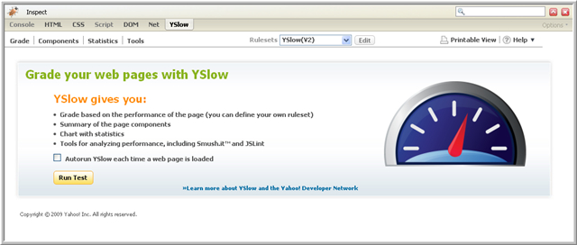

# Firefox常用web开发插件

Debugging工具\
1、 [Firebug](http://getfirebug.com/)

Firebug是firefox下的一个插件,能够调试所有网站语言,如Html,Css等，但FireBug最吸引我的就是javascript调试功 能，使用起来非常方便，而且在各种浏览器下都能使用（IE,Firefox,Opera, Safari），简直难以置信。除此之外，其他功能还很强大。比如html,css,dom的察看与调试，网站整体分析等等。总之就是一整套完整而强大的 WEB开发工具。做的太牛了。再有就是开源的，前途不可限量阿。\
Firebug官网：http://getfirebug.com/\
在javascript中支持断点调试，在css的查看中对属性值更改会马上看到效果(也算是 对css的调试吧)，而且可以方便的看到是哪个css，功能是强大的没的说！在控制台还会像终端一样的输出运行的异步请求啊，哪个地方解析的时候出错了， 开启方便，在开启以后可以用直接打开编辑器编辑对应的文件。\
总体的印象是简约而不简单，十分适合编程人员使用！\
2、[FirePHP](https://addons.mozilla.org/en-US/firefox/addon/6149)\
FireBug是针对CSS、HTML和JavaScript的一款很好的开发工具，但是FirePHP只有在用户安装了FireBug之后才可用，可以 为PHP开发者所用，便于他们管理PHP函数。\

\
 \
3、[JavaScript Debugger](http://addons.mozilla.org/en-US/firefox/addon/216 "Mozilla Addons")\
一个强大的javascript调试工具.\
 \
Analysis工具\
1、[Coral IE tab](https://addons.mozilla.org/zh-CN/firefox/addon/10909)\
在firefox的tab中用ie打开页面，是改进版的IE Tab，可以随时在IE和Firefox引擎之间切换。由于支持Cookie的传递，所以对于需要登录的网站，切换后不必重新登录。用WTL完全重写了插 件的链接库文件，提供了更好的性能。\
2、[OperaView](http://addons.sociz.com/firefox/389/)  在 Firefox, Mozilla, Flock 和 Netscape 8 中调用 Opera 浏览器查看当前网页的扩展。\
3、 [View Source Chart](https://addons.mozilla.org/zh-CN/firefox/addon/655 "View Source Chart")  以图表的形式显示页面中用到的颜色。\
4、 [View Dependencies](https://addons.mozilla.org/zh-CN/firefox/addon/2214 "View Dependencies")\
View Dependencies 火狐扩展是一款在“查看页面信息”的窗口增加了一个标签，用来显示在当前页面中所有已载入文件的扩展。这个文件列表依次按照主机域名和文件类别（图象，样 式表，脚本…）排序，并显示每个文件的大小，包含在每个域名下的所有文件大小以及包含在当前页面的所有文件大小。通过右键菜单，你可以选择在新标签页 或者新窗口打开任何一个选中的文件。 你还可以把文件的 URL 地址复制到剪贴板。版本号: View Dependencies 0.3.3.0适用于: Firefox 1.0 – 3.0b5pre Flock 0.4 – 1.0+ Mozilla 1.4 – 1.8 SeaMonkey 1.0 – 2.0a1 下载地址: http://addons.mozine.cn/firefox/714/\
5、 [lori](https://addons.mozilla.org/zh-CN/firefox/addon/1743 "lori")   告诉你加载页面花了多长时间.\
6、[HTML Validator](https://addons.mozilla.org/zh-CN/firefox/addon/249 "HTML Validator")  HTML语法校验插件，能够在状态栏的图标上标注当前页面的HTML语法错误数量，不仅会校检服务器发送来的 HTML文件，也会校检内存中的HTML代码(通常为执行Ajax请求后的返回值)。\
7、[CSS Validator](https://addons.mozilla.org/zh-CN/firefox/addon/2289)   验证css语法.用W3C的CSS标准来校检页面，在新页面中显示校检结果，不过只对包含了CSS样式文件的页面起作用，其快捷按钮既可添加在右键菜单中也可添在工具栏 上。\
8、[RSS Validator](https://addons.mozilla.org/zh-CN/firefox/addon/2294)   验证RSS格式.\
9、[Window Resizer](http://addons.mozilla.org/en-US/firefox/addon/1985 "Mozilla Addons")    调整窗口大小到各类标准大小，如1024\*768，800\*600等等，方便在各个大小下查看页面的显示效果.\
9、[Dafizilla ViewSourceWith](http://dafizilla.sourceforge.net/viewsourcewith/ "ViewSourceWith")\
默认情况下firefox中的“查看页面源代码”使用firefox的一个窗口打开的，这个插件可以指定外部的应用程序来浏览页面源代码。主要的目的是使用外部程序浏览页面原代码，但是你还可以⋯⋯ – 以 DOM 文件的方式打开页面原代码，参见 FAQ – 打开页面使用的 CSS 和 JS 文件 – 用你指定的图像浏览软件（比如 GIMP 或者 ACDSee）打开图像 – 用 Acrobat Reader 或 Foxit Reader 或者你指定的程序打开 PDF 链接 – 用你喜欢的文本编辑器编辑 textbox 中的内容，并且在将焦点切换回 textbox 的时候你可以在浏览器中立刻看见修改后的文字，简化了 wiki 页面的编辑，参见 FAQ – 打开服务器端生成浏览器内容的页面，简化了 web 开发者的 debug 工作，参见 server-faq – 打开 Javascript 控制台中列出的文件。当文本编辑器打开文件时光标可以移动到 javascript 控制台显示的行，参见 js faq 你也可以将 Microsoft IE 添加到编辑器列表。\
\
 \
10、[CSS Usage](https://addons.mozilla.org/zh-CN/firefox/addon/10704?src=api)\
一个基于firebug的firefox扩展，可以用来查看页面中的CSS的使用情况，可以清楚的查看css文件中所有的规则在你的网站中的 真实的使用情况。可以查看一个网站中多个页面中的css使用情况，借此可以看到CSS的在网站中的全局使用情况。\
\
预览：\
\
 \
11、[YSlow](https://addons.mozilla.org/zh-CN/firefox/addon/5369)\
YSlow是一个非常有用的工具，用于Firefox的优化。 YSlow能为任何网页做报告，并审查信息的数量，HTTP请求， CDNs使用， CSS和JS compression会给您一个评分，并告诉你如何改善此网页，以便加载更快。判别网页性能的依据是Yahoo!’s Exceptional Performance team has identified 34 rules that affect web page performance.\
\
 \
SEO:\
1、[Niche Watch Tool](https://addons.mozilla.org/en-US/firefox/addon/2279)：\
 \
This wonderful SEO extension provides you the technical information required to beat your competitor websites in serps.It gives you backlinks number, indexed pages, keyword occurences on the page, page rank, all in anchor, all in title and all in text rank for both domain and webpage information.\
This cool firefox extension is very useful for webmasters and seo professionals for analyzing niche keyword competition for ranking at top in Google.\
2、[KGen](https://addons.mozilla.org/en-US/firefox/addon/4788)：\
KGen (Keyword Generator) is an extension that allows you to see what keywords are strong on visited web pages. Than, you can retrieve them for social sharing (tag filling) or webmastering/SEO.\
 \
其他：\
1、[Web Developer](https://addons.mozilla.org/en-US/firefox/addon/60)\
https://addons.mozilla.org/zh-CN/firefox/addon/60?src=api\
Web Developer 可说是网页设计师最常使用的一个 Firefox 扩充套件，它可以协助我们在设计网页时能够更加的得心易手，内建 HTML、CSS、Feed…等检验器，让我们所设计出来的网页能够符合标准化，不但可以省下日后维护的时间金钱，更能确保我们所设计出来的网页在各家不同的浏览器，均能正常地显示，且是符合我们预想的成果。其它更有取消 CSS、取消 Java、取消 JavaScript、检视或清除 Cookies…等功能。\
2、[ShowIP](https://addons.mozilla.org/en-US/firefox/addon/590)   显示当前浏览页面对于的IP地址.\
3、 [ServerSpy](https://addons.mozilla.org/en-US/firefox/addon/590)   显示当前浏览页面所在web server的具体名称和版本号\
 \
注：花了将近3个小时写这篇文章，浏览了很多有关Firefox插件的文章，汇总了一下，希望能对大家有帮助，在选择插件的时候能更快的找到适合自己的插件。\