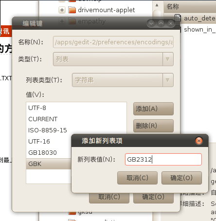
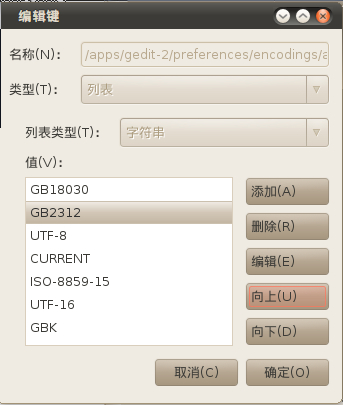
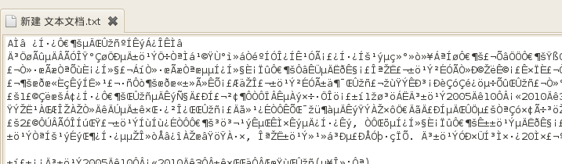
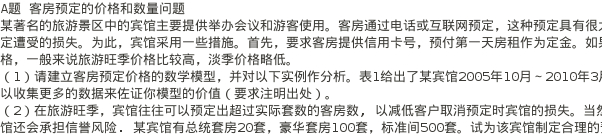

# ubuntu下txt文件中文显示乱码的方法【转载】

转载地址：http://apps.hi.baidu.com/share/detail/10311333\
**刚装ubuntu后，打开windows下的TXT文件就会发现无法显示中文，出现大量乱码。**\
这时候需要设置一下。\
\
在终端打：\
gconf-editor                            //调出gconf-edit\
然后依次点开：\
apps->gedit-2->preferences－＞encodings\
双击encodings中的auto-detected\
在弹开的对话框中加入\
GB18030，GBK，GB2312\
\
再将GB18030,GB2312移到最上\
\
接着确定退出就OK了\
看看效果图\
解决前\
解决后\

来自: <http://hi.baidu.com/little%D5%C1/blog/item/41fec93dc789d2e055e723f2.html>