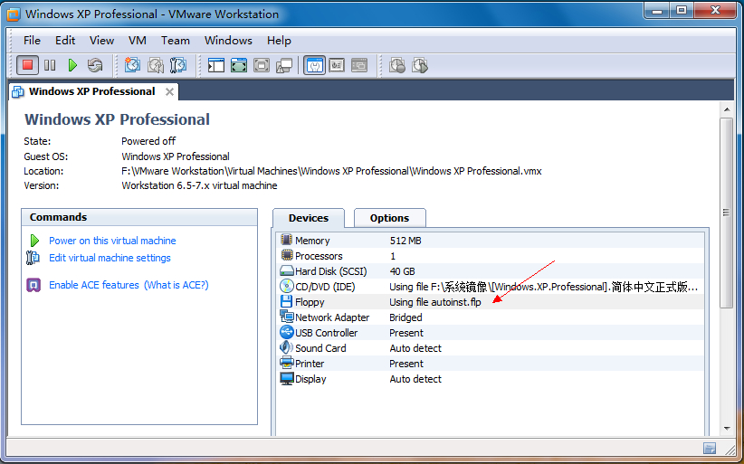
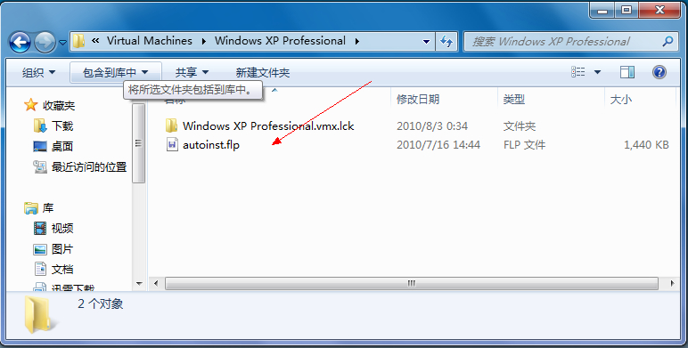
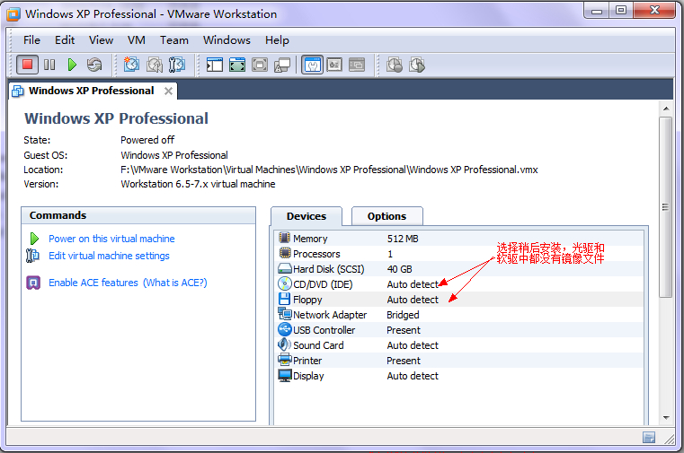
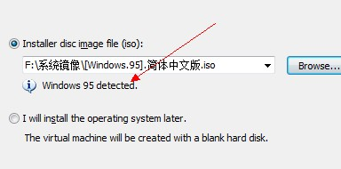
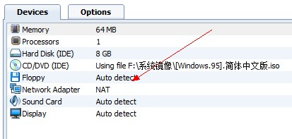

# VMware Easy Install模式详细介绍：如何启用和禁用Easy Install模式（图文）-上【转载】

转载地址：

http://hi.baidu.com/i\_coolboy/blog/item/433149d3f33aa0d2a8ec9a69.html

Workstation的Easy Install模式让很多人费解，这个本来应该让安装虚拟系统简单化的功能却给大家带来了不少的麻烦。今天我就结合Vmware的用户手册详细介绍一下 Vmware的Easy Install模式，把自己的经验同大家分享一下。\
The easy install features enable you to perform an unattended installation of the guest operating system after you complete the New Virtual Machine wizard.意思是easy install模式就是在设置新虚拟机向导之后你就不必参与到虚拟机的安装中，整个过程由软件自动完成。只要在向导中填入CDKey、用户名、系统密码等 信息，VMware在安装过程中自动进行分区格式化、注册系统、设置用户名密码、自动登录以及安装VMware Tools等操作，而不需人工干预，这自然能大大节省很多的时间和精力。但前提必须正确填写了各种信息，并且安装过程中不需要更换CD或镜像，否则安装同 样会中止！\
\
WMware Easy Install模式的工作过程：\
新建虚拟机File->New->Virtual Machine…出现虚拟新向导New Virtual Machine Wizard，选择典型推荐安装Typical，然后next，Install from:选择从物理光驱或者磁盘镜像文件安装都可以，如果选择了最后一项自定义安装I will install the operating system later，就不会启动Easy Install。\
选择从物理光驱或者磁盘镜像文件安装之后VMware会自动侦测光盘的实际内容确定即将安装的系统及版本。目前一般只识别原版的系统，不会识别Ghost 版本的，并且光盘或镜像的名字不会影响识别的结果。Ghost版本的系统同样可以用Easy Install模式安装，因为一旦选择的光盘或镜像无法识别Next之后便会出现手工选择系统及版本的向导，选择对应的系统及版本，VMware同样根据 选择的结果进行相对应的Easy Install安装。如果是自动识别了则不需要这一步，值得注意的是不要选错了，因为不同的系统简易安装的要求的信息和步骤是不一样的。本人试验过用 DOS的ISO镜像而系统版本选择Windows XP Professional，结果出现不可预见的错误。\
之后填写CDKey、用户名、系统密码、虚拟机名、虚拟机位置以及磁盘大小等信息Next之后便是Finish，在这里我们不选择Power on this virtual machine after creation，点击Finish。之后我们会发现在虚拟系统的设置中的FLoppy的connection选择Use floppy inage file并且已经自动加载了一个autoinst.flp的软盘镜像，这个镜像位于此虚拟系统的安装目录下，而之前若选择了I will install the operating system later，此时Floppy使用物理软驱Auto detect。\
\
上图使用Easy Install模式，完成向导后，软驱Floppy中自动加载了一个autoinst.flp软盘镜像。\
\
这个autoinst.flp镜像存在于这个虚拟机目录下。\
\
对于自定义安装I will install the operating system later，完成向导后不自动加载任何镜像。\
这个autoinst.flp至关重要，顾名思义它是VMware根据detect或者人工选择的结果自动生成的与系统版本对应的Easy Install文件，它包含了你刚刚在虚拟机向导中输入的安装过程中需要的信息，以及自动安装需要完成步骤和操作。Vmware用它控制着系统的安装过 程，不同系统版本的autoinst.flp自然也就不一样的，所以有上面安装DOS系统时出错的情况。\
同时Vmware的Easy Install模式只支持部分的系统和版本，也就是说有些版本是无法使用Easy Install模式进行安装的，即使被识别出来，自然也不会生成autoinst.flp（如图，Win95）。\
      \
如上图安装向导识别出Windows 95，但是完成软驱Floppy没有加载autoinst.flp。\
对于Windows只支持以下版本：\
Windows Vista, Windows 7, Windows XP, and Windows 2000\
Windows Server 2008, Windows Server 2003, and Windows 2000 Server\
对于Linux支持以下版本：\
Ubuntu Desktop 7.10 and later\
Ubuntu Server 8.10 and later\
Red Hat Enterprise Linux 3 through 5\
Asianux Server 3\
Fedora Core 4 through 12 with the exception of Fedora Core 8\
SUSE Linux Enterprise Server 10 SP3\
SUSE Linux Enterprise Desktop 10 SP3\
SUSE Linux Enterprise Server 11 GA\
SUSE Linux Enterprise Desktop 11 GA\
openSUSE 11.3 GA\
限于篇幅请继续阅读下篇!