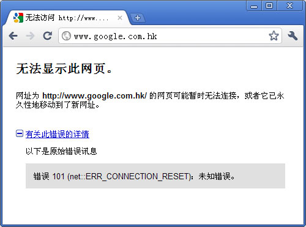

# Google打不开的解决方法【转自月光博客】

在Google.com里面进行搜索的时候，经常会遇到突然出现“该页无法显示”的提示，并且之后的十多分钟都无法正常连接Google，这里给出一些方法，可以解决大部分Google无法访问或进不去的问题。\
1、最开始可以先尝试重新拨号的方法。如果是搜索过程中出现“该页无法显示”的提示，接着就无法访问Google，那么对于ADSL用户，可以尝试断开网络连接，然后重新拨号上网，这样你的IP地址就发生了变化，这时候就可以正常访问Google了。（其原理是防火墙只是针对IP封用户，而不是针对独立电脑）\
2、如果一开始就无法访问Google，那么请把下面这一行：\
216.239.63.104 www.google.com 或者 64.233.171.99 www.google.com 或者 216.239.53.99 www.google.com\
添加到：C:WINDOWSsystem32driversetchosts文件里，就着访问Google看看是否正常。（其原理是提供较为少用的Google镜像访问）\
3、使用Google的镜像IP地址来访问Google，Google有很多IP地址，通过IP可以直接访问Google。\
4、使用Google其他国家的域名来访问Google，例如Google日本的域名google.co.jp，不过请注意，Google其他国家的服务器也在美国，因此搜索词语的时候也会出现“该页无法显示”的可能。\
5、如果碰到DNS劫持的封锁方法，那么需要选择正确的DNS服务器，将主DNS设置成国外根服务器的DNS，然后辅助DNS设置成国外的DNS。具体做法：在拨号网络或网卡属性里设置，主DNS设成 202.12.27.33，辅助DNS：202.216 .228.18（日本DNS），或者使用美国的OpenDNS，首选DNS服务器和备用DNS服务器分别设置为208.67.222.222和 208.67.220.220。大家还可以自己找一些快的国外DNS。 （其原理是DNS劫持只能够控制国内的DNS服务器，而对于国外的DNS服务器则无能为力，因此只要不使用国内的DNS即可）\
6、对于 GMail，使用http访问访问的话最好不要选择“带有聊天功能的标准视图”，否则容易中断。尽量使用加密的https地址 https://mail.google.com 来访问GMail，这将极大提高访问的稳定性，并且在GMail里使用GTalk也很稳定。\
7、使用加密的代理服务器软件（SSH，VPN）来访问Google，当然目前的一些免费的加密代理服务器都不是很稳定，速度也不是很理想，建议购买收费版。\
8、使用HTTPS来访问Google，由于Google的Https域名encrypted.google.com也被DNS污染，因此需要修改 hosts文件，Windows系统中Hosts文件的优先级高于DNS服务器，操作系统在访问某个域名时，会先检测HOSTS文件，然后再查询DNS服务器。可以在hosts添加受到污染的DNS地址来解决DNS污染和DNS劫持。\
\
当然，上面的方法有时可能会实效，我觉得最稳定和有效的方法是HTTPS的Google搜索，HTTPS版本的Google一劳永逸地解决目前几乎所有的问题，https是安全访问网站的一个重要的方法，目前还没有看到能截获https的加密数据的防火墙，因此搜索任何关键字都没有问题，目前 Google的HTTPS搜索唯一的遗憾是没有图片搜索功能。