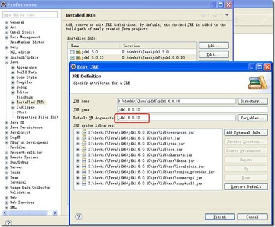
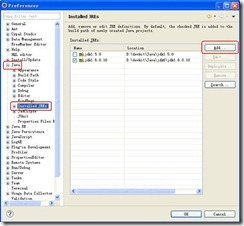
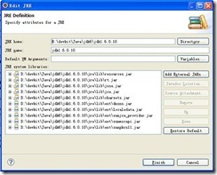
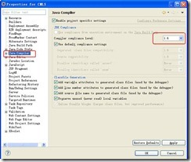
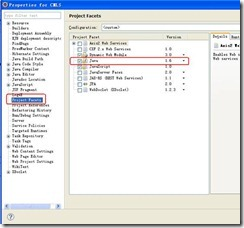
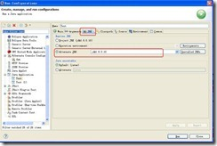

# could_not_find_the_main_class(eclipse不能运行类)【转载】

最近做项目把JDK的版本升到了1.6，但是问题也就随之而来。\
首先，在eclipse中启动Tomcat服务器，始终不能启动\
\
java.lang.NoClassDefFoundError: jdk1/6/0/10\
开始以为是版本不兼容，但是直接发布在Tomcat目录下，直接点击Tomcat的StartUp.bat是可以启动的，运行正常。\
于是写了一个测试类，在eclipse中运行这个类，只是输出几个字符，居然也不可以，报错信息一样。\
Google了些信息出来，无非是说设置path，classpath等，按照这个照做后，很遗憾，报错信息依旧，而且我原来用1.5版本时也没有配置这些变量。\
整整一个下午的时间，头晕脑胀，却一无所获。\
其实是一个地方的配置写错了。大家注意了：\
\
红色框起来的地方，这里本来是输入vm参数的，结果我copy/paste，当成了jre的名字，这个参数jre当然不会识别了，但是jre提示的信息也有点过，你要是说“vm参数错误”不就好找了，偏偏说java.lang.NoClassDefFoundError: jdk1/6/0/10。\
下面总结一下：\
在用eclipse时无需在环境变量中配置path、classpath等。\
在eclipse中配置jre\
\
\
\
配置编译选项\
\
再针对具体工程设置\
[![clip_image012[1]](images/201108141349417056_c0bf4f02.jpg "clip_image012[1]")](http://images.cnblogs.com/cnblogs_com/evasnowind/201108/20110814134939908.jpg)\
\
\
\
运行时类配置\
\
\
好了，完结。\
希望对大家有帮助。