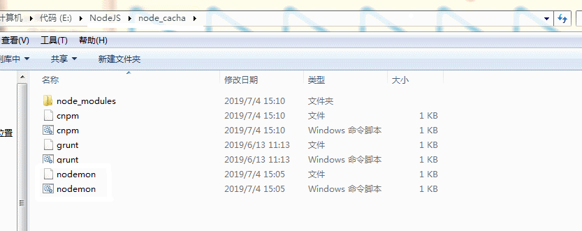
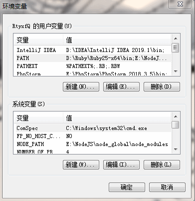

# NodeJs：安装插件‘xxx’后，提示‘xxx’ 不是内部或外部命令也不是可运行的程序或批处理文件【转载】

版权声明：本文为博主原创文章，遵循 CC 4.0 by-sa 版权协议，转载请附上原文出处链接和本声明。\
本文链接：https://blog.csdn.net/weixin\_42941619/article/details/94627644\
1：首先使用npm、cnpm或者yarn下载所需插件，以nodemon这个插件举例

npm install -g nodemon

2： 命令行查询插件版本信息

nodemon –version

3：如果提示‘nodemon’ 不是内部或外部命令解决方法

找到nodejs下的nodemon插件，复制此路径！下面要用到。

4：右击–我的电脑–单击属性–高级系统设置–环境变量

选中用户变量的path，然后编辑，然后将第三步复制的路径添加到path配置中，保存，保存，保存！

5：重新打开命令行工具

nodemon –version

这样就解决了’xxx’插件不是内部或外部命令也不是可运行的程序或批处理文件的问题。

巴拉巴拉：

==主页传送门==\
————————————————\
版权声明：本文为CSDN博主「雨雪风晴是你」的原创文章，遵循CC 4.0 by-sa版权协议，转载请附上原文出处链接及本声明。\
原文链接：https://blog.csdn.net/weixin\_42941619/article/details/94627644