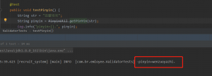

# java 汉字转拼音

建议使用pinyin4j，作为老牌的拼音转汉字解决方案，个人感觉比较可靠。小站用这个应该够用了。\
可以参考该帖子：[使用 pinyin4j API 将汉字转换为拼音 （学习笔记）](https://blog.csdn.net/sky_limitless/article/details/79443540)\
hutool工具包中有一个PinyinUtil工具类，目前已被弃用，不推荐使用，因为某些汉字可能会被转错，比如下图中的“馨”：

