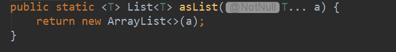
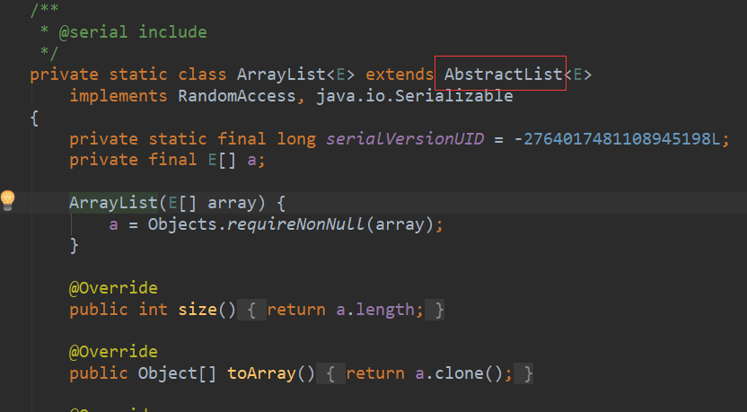
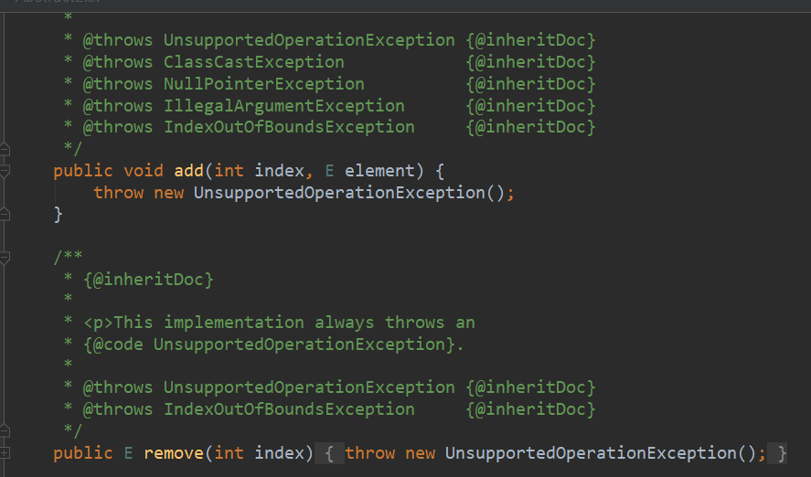
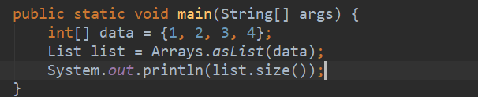
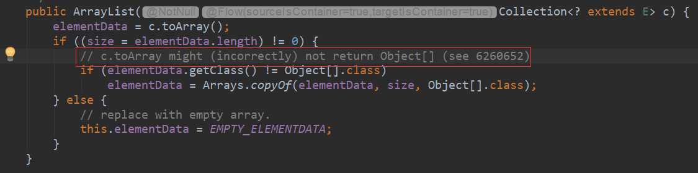
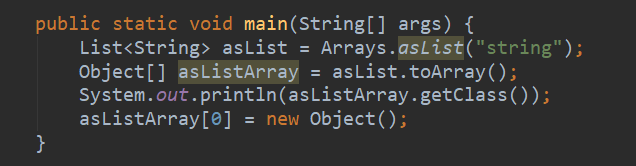
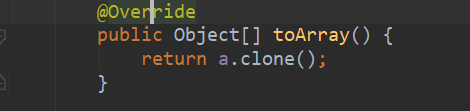

# Arrays.asList中所遇到的坑【转载】

转载自：https://www.cnblogs.com/wang-meng/p/f1532cf23ce049ce63b4bdd62d53659d.html

## 前言

最近在项目上线的时候发现一个问题，从后台报错日志看：**java.lang.UnsupportedOperationException异常**\
从代码定位来看，原来是使用了Arrays.asList()方法时把一个数组转化成List列表时，对得到的List列表进行add()和remove()操作, 所以导致了这个问题。

对于这个问题，现在来总结下，当然会总结Arrays下面的一些坑。

## 源代码分析

首先，遇到问题不可怕，遇到问题解决就是了，但是必须要保证下次不会再犯相同的问题。\
Arrays.asList返回的是同样的ArrayList，为什么就不能使用add和remove方法呢？

1，查看Arrays.asList 源码\
,

2，查看此ArrayList结构：\

3， 在查看AbstractList结构：\

果然，UnsupportedOperationException 是这里抛出的，因为Arrays中的ArrayList并没有实现此方法，故抛出了异常。\
**所以说 Arrays.asList 返回的 List 是一个不可变长度的列表，此列表不再具备原 List 的很多特性，因此慎用 Arrays.asList 方法。**

## Arrays中其他坑

1，下面程序输出是什么？\
\
**打印结果是：1**\
由上面asList 源码我们可以看到返回的 Arrays 的内部类 ArrayList 构造方法接收的是一个类型为 T 的数组，而基本类型是不能作为泛型参数的，所以这里参数 a 只能接收引用类型，自然为了编译通过编译器就把上面的 int[] 数组当做了一个引用参数，所以 size 为 1，要想修改这个问题很简单，将 int[] 换成 Integer[] 即可。所以**原始类型不能作为 Arrays.asList 方法的参数，否则会被当做一个参数。**

2，Collections.toArray报错问题\
大家可以看下 java.util.ArrayList 源码 中特别标记有一句话如下：\
\
Bug地址：<https://bugs.java.com/view_bug.do?bug_id=6260652>\
那下面来试验下什么情况下会出现这种异常：\

如上图，这种控制台打印的结果如下：\
**class [Ljava.lang.String;**\
**Exception in thread “main” java.lang.ArrayStoreException: java.lang.Object**

我们查看Arrays中ArrayList的toArray源码：\
\
因为asList返回的是一个String数组，所以这里toArray返回的其实是String[]类型，只不过是这里做了一个向上转型，将String[]类型转为Object[]类型罢了。\
但是注意，虽然返回的引用为Object[]，但实际的类型还是String[],当你往一个引用类型和实际类型不匹配的对象中添加元素时，就是报错。\
具体大家可以参考Java向上转型和向下转型的相关知识点。

关于Arrays中的坑就说到这里，有补充的欢迎留言。