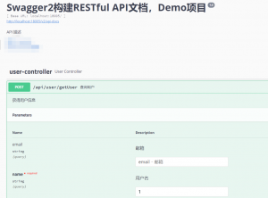
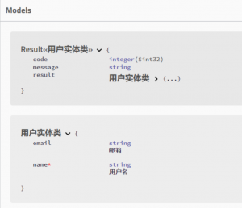
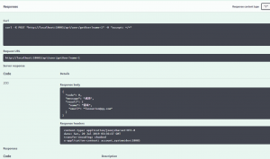

# spring boot整合swagger

本文仅展示总体配置，具体注解用法请另行搜索、查询。

## 1.加上maven依赖，引入相关包

```
</pre>
<pre><dependency>
    <groupId>io.springfox</groupId>
    <artifactId>springfox-swagger2</artifactId>
    <version>2.9.2</version>
</dependency>
<dependency>
    <groupId>io.springfox</groupId>
    <artifactId>springfox-swagger-ui</artifactId>
    <version>2.9.2</version>
</dependency>
<!-- https://mvnrepository.com/artifact/io.swagger.core.v3/swagger-annotations -->
<dependency>
    <groupId>io.swagger.core.v3</groupId>
    <artifactId>swagger-annotations</artifactId>
    <version>2.0.8</version>
</dependency>
<!-- http://localhost:18004/doc.html -->
<dependency>
    <groupId>com.github.xiaoymin</groupId>
    <artifactId>swagger-bootstrap-ui</artifactId>
    <version>1.8.8</version>
</dependency>
<!-- Swagger用了高版本的 -->
<dependency>
    <groupId>com.google.guava</groupId>
    <artifactId>guava</artifactId>
    <version>28.0-jre</version>
</dependency></pre>
<pre>
```

## 2.spring boot项目中加入配置类

添加一个配置对象，大体代码如下：

```


package com.demo.config;

import org.springframework.context.annotation.Bean;
import org.springframework.context.annotation.Configuration;
import org.springframework.context.annotation.Profile;

import io.swagger.annotations.Api;
import springfox.documentation.builders.ApiInfoBuilder;
import springfox.documentation.builders.PathSelectors;
import springfox.documentation.builders.RequestHandlerSelectors;
import springfox.documentation.service.ApiInfo;
import springfox.documentation.service.Contact;
import springfox.documentation.spi.DocumentationType;
import springfox.documentation.spring.web.plugins.Docket;
import springfox.documentation.swagger2.annotations.EnableSwagger2;

/**
* Swagger2配置
* http://localhost:18005/swagger-ui.html
* http://localhost:18005/doc.html
*/
@Configuration
@EnableSwagger2
@Profile({"dev", "pre"})
class SwaggerConfig {
/**
* swagger2的配置文件，这里可以配置swagger2的一些基本的内容，比如扫描的包等等
*/
@Bean
public Docket createRestApi() {
return new Docket(DocumentationType.SWAGGER_2)
.apiInfo(apiInfo())
.select()
.apis(RequestHandlerSelectors.withClassAnnotation(Api.class))
//为当前包路径
//.apis(RequestHandlerSelectors.basePackage("com.br.demo.controller"))
.paths(PathSelectors.any())
.build();
}

/**
* 构建 api文档的详细信息函数
*/
private ApiInfo apiInfo() {
ApiInfo apiInfo = new ApiInfoBuilder()
//页面标题
.title("账务系统接口API文档")
//创建人
.contact(new Contact("xx", "http://xx.100credit.cn", "xx@100credit.com"))
//版本号
.version("1.0")
//描述
.description("账务系统接口大全")
.build();
return apiInfo;
}
}


```

## 3.用各种注解加入接口说明

例如controller

```


import javax.annotation.Resource;

import org.springframework.web.bind.annotation.PostMapping;
import org.springframework.web.bind.annotation.RequestBody;
import org.springframework.web.bind.annotation.RequestMapping;
import org.springframework.web.bind.annotation.RestController;

import com.demo.bean.model.User;
import com.demo.common.result.Result;
import com.demo.common.result.ResultUtils;
import com.demo.controller.BaseController;
import com.demo.service.UserService;

import io.swagger.annotations.Api;
import io.swagger.annotations.ApiImplicitParam;
import io.swagger.annotations.ApiOperation;

@RestController
@RequestMapping("api/user")
@Api("UserController相关的api")
public class UserController extends BaseController {

@Resource
private UserService userService;

@ApiOperation(value = "查询用户", notes = "获得用户信息")
@PostMapping("/getUser")
private Result<User> getUser(User user) {
User userResult = new User();
userResult.setName("xx");
userResult.setEmail("xx@qq.com");
return ResultUtils.succeed(userResult);
}
}

```

实体类示例：

```


Model模型类

import io.swagger.annotations.ApiModel;
import io.swagger.annotations.ApiModelProperty;
import lombok.Data;

@ApiModel("用户实体类")
@Data
public class User {

@ApiModelProperty(name="name",value="用户名",required=true)
private String name;

@ApiModelProperty(name="email",value="邮箱",required=false)
private String email;
}

```

## 4. 效果







## 5. 如果配置了shiro或是拦截器，注意需要打开相关权限

以shiro为例，需做如下配置：

```


//对swagger2相关接口放行，5个配置
filterChainDefinitionMap.put("/doc.html", "anon");
filterChainDefinitionMap.put("/swagger-ui.html", "anon");
filterChainDefinitionMap.put("/swagger-resources/**", "anon");
filterChainDefinitionMap.put("/v2/api-docs/**", "anon");
filterChainDefinitionMap.put("/webjars/springfox-swagger-ui/**", "anon");

```

## 6. swagger接口显示地址

- http://ip:端口/swagger-ui.html   Swagger官方UI
- http://ip:端口//doc.html   第三方Bootstarp皮肤的UI

## 7.参考文档

swagger2 注解说明 ( @ApiImplicitParams )\
https://blog.csdn.net/jiangyu1013/article/details/83107255

spring boot项目中使用swagger2\
https://www.jianshu.com/p/05be40b9a7a3

spring boot 整合 swagger2,并设置post,get请求方式\
https://blog.csdn.net/qq\_36249132/article/details/90109815